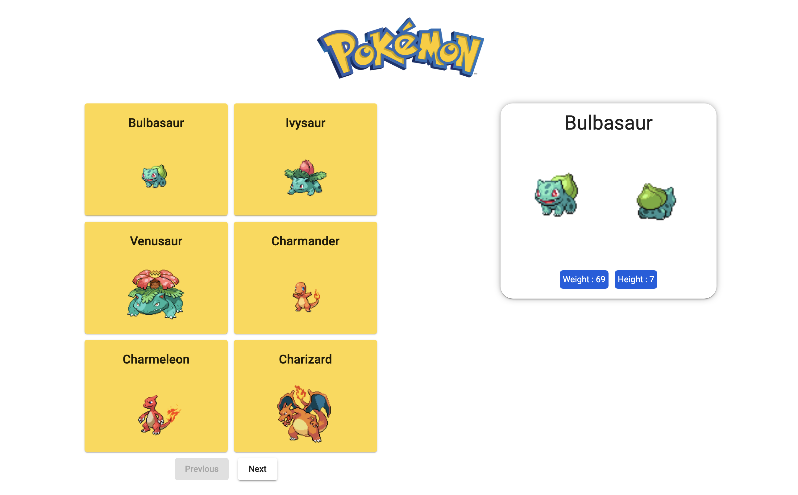

# Pokedex

## Welcome! 👋

This project gets pokemons from an API.

Stacks used :
- Angular v13.2.5
- Material Angular

API used : 
- https://pokeapi.co

## Development server
Run `ng serve` for a dev server. Navigate to `http://localhost:4200/`. The app will automatically reload if you change any of the source files.

